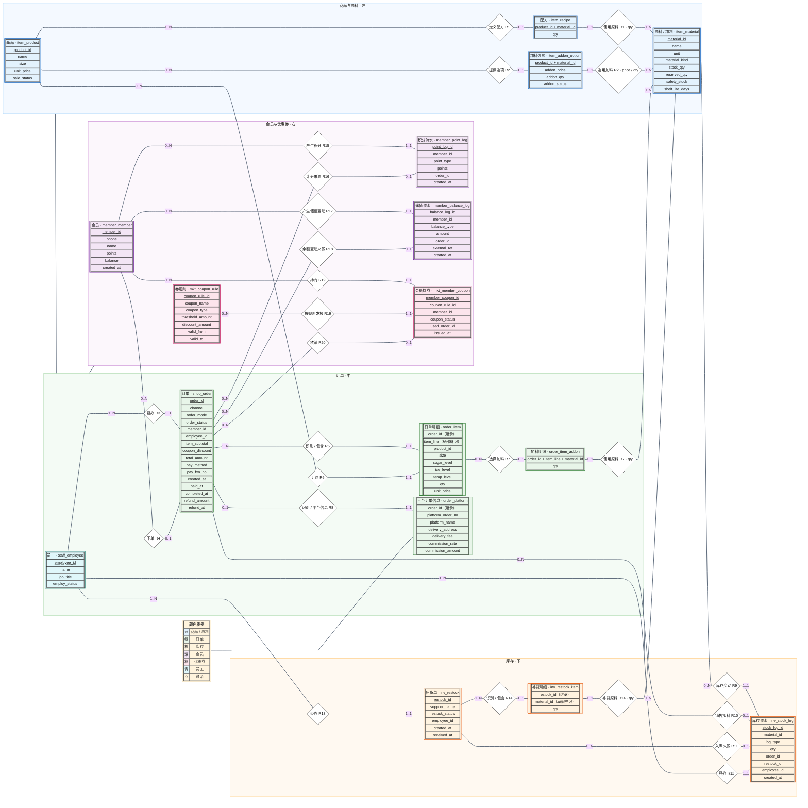

# Chen 简化 ER 图

> 订单与订单明细放在中心；商品/原料位于左侧，会员与优惠券位于右侧，库存在下方。实体框列出数据字典中的全部 110 个属性，主码加下划线。图内颜色图例说明业务域；白色菱形表示联系。Mermaid 使用 Dagre 和平滑曲线布局，减少正交折线重合。

```mermaid
%%{init: {"theme": "base", "themeVariables": {"fontFamily": "Arial, Microsoft YaHei, sans-serif", "fontSize": "10px", "lineColor": "#475569", "textColor": "#172033"}, "flowchart": {"defaultRenderer": "dagre", "curve": "basis", "nodeSpacing": 4, "rankSpacing": 8, "padding": 1}}}%%
flowchart LR
    subgraph left_domain[商品与原料 · 左]
      direction TB
      P["<table border='1' cellpadding='1' cellspacing='0'><tr><td>商品 · item_product</td></tr><tr><td><u>product_id</u></td></tr><tr><td>name</td></tr><tr><td>size</td></tr><tr><td>unit_price</td></tr><tr><td>sale_status</td></tr></table>"]
      M["<table border='1' cellpadding='1' cellspacing='0'><tr><td>原料 / 加料 · item_material</td></tr><tr><td><u>material_id</u></td></tr><tr><td>name</td></tr><tr><td>unit</td></tr><tr><td>material_kind</td></tr><tr><td>stock_qty</td></tr><tr><td>reserved_qty</td></tr><tr><td>safety_stock</td></tr><tr><td>shelf_life_days</td></tr></table>"]
      RP["<table border='1' cellpadding='1' cellspacing='0'><tr><td>配方 · item_recipe</td></tr><tr><td><u>product_id + material_id</u></td></tr><tr><td>qty</td></tr></table>"]
      AO["<table border='1' cellpadding='1' cellspacing='0'><tr><td>加料选项 · item_addon_option</td></tr><tr><td><u>product_id + material_id</u></td></tr><tr><td>addon_price</td></tr><tr><td>addon_qty</td></tr><tr><td>addon_status</td></tr></table>"]
      R1a{"定义配方 R1"}
      R1b{"使用原料 R1 · qty"}
      R2a{"提供选项 R2"}
      R2b{"选用加料 R2 · price / qty"}
    end

    subgraph center_domain[订单 · 中]
      direction TB
      E["<table border='1' cellpadding='1' cellspacing='0'><tr><td>员工 · staff_employee</td></tr><tr><td><u>employee_id</u></td></tr><tr><td>name</td></tr><tr><td>job_title</td></tr><tr><td>employ_status</td></tr></table>"]
      O["<table border='1' cellpadding='1' cellspacing='0'><tr><td>订单 · shop_order</td></tr><tr><td><u>order_id</u></td></tr><tr><td>channel</td></tr><tr><td>order_mode</td></tr><tr><td>order_status</td></tr><tr><td>member_id</td></tr><tr><td>employee_id</td></tr><tr><td>item_subtotal</td></tr><tr><td>coupon_discount</td></tr><tr><td>total_amount</td></tr><tr><td>pay_method</td></tr><tr><td>pay_txn_no</td></tr><tr><td>created_at</td></tr><tr><td>paid_at</td></tr><tr><td>completed_at</td></tr><tr><td>refund_amount</td></tr><tr><td>refund_at</td></tr></table>"]
      I[["<table border='1' cellpadding='1' cellspacing='0'><tr><td>订单明细 · order_item</td></tr><tr><td>order_id（继承）</td></tr><tr><td>item_line（局部辨识）</td></tr><tr><td>product_id</td></tr><tr><td>size</td></tr><tr><td>sugar_level</td></tr><tr><td>ice_level</td></tr><tr><td>temp_level</td></tr><tr><td>qty</td></tr><tr><td>unit_price</td></tr></table>"]]
      IA["<table border='1' cellpadding='1' cellspacing='0'><tr><td>加料明细 · order_item_addon</td></tr><tr><td><u>order_id + item_line + material_id</u></td></tr><tr><td>qty</td></tr></table>"]
      OP[["<table border='1' cellpadding='1' cellspacing='0'><tr><td>平台订单信息 · order_platform</td></tr><tr><td>order_id（继承）</td></tr><tr><td>platform_order_no</td></tr><tr><td>platform_name</td></tr><tr><td>delivery_address</td></tr><tr><td>delivery_fee</td></tr><tr><td>commission_rate</td></tr><tr><td>commission_amount</td></tr></table>"]]
      R3{"经办 R3"}
      R4{"下单 R4"}
      R5{"识别 / 包含 R5"}
      R6{"订购 R6"}
      R7a{"选择加料 R7"}
      R7b{"使用原料 R7 · qty"}
      R8{"识别 / 平台信息 R8"}
    end

    subgraph right_domain[会员与优惠券 · 右]
      direction TB
      MM["<table border='1' cellpadding='1' cellspacing='0'><tr><td>会员 · member_member</td></tr><tr><td><u>member_id</u></td></tr><tr><td>phone</td></tr><tr><td>name</td></tr><tr><td>points</td></tr><tr><td>balance</td></tr><tr><td>created_at</td></tr></table>"]
      PL["<table border='1' cellpadding='1' cellspacing='0'><tr><td>积分流水 · member_point_log</td></tr><tr><td><u>point_log_id</u></td></tr><tr><td>member_id</td></tr><tr><td>point_type</td></tr><tr><td>points</td></tr><tr><td>order_id</td></tr><tr><td>created_at</td></tr></table>"]
      BL["<table border='1' cellpadding='1' cellspacing='0'><tr><td>储值流水 · member_balance_log</td></tr><tr><td><u>balance_log_id</u></td></tr><tr><td>member_id</td></tr><tr><td>balance_type</td></tr><tr><td>amount</td></tr><tr><td>order_id</td></tr><tr><td>external_ref</td></tr><tr><td>created_at</td></tr></table>"]
      CR["<table border='1' cellpadding='1' cellspacing='0'><tr><td>券规则 · mkt_coupon_rule</td></tr><tr><td><u>coupon_rule_id</u></td></tr><tr><td>coupon_name</td></tr><tr><td>coupon_type</td></tr><tr><td>threshold_amount</td></tr><tr><td>discount_amount</td></tr><tr><td>valid_from</td></tr><tr><td>valid_to</td></tr></table>"]
      MC["<table border='1' cellpadding='1' cellspacing='0'><tr><td>会员持券 · mkt_member_coupon</td></tr><tr><td><u>member_coupon_id</u></td></tr><tr><td>coupon_rule_id</td></tr><tr><td>member_id</td></tr><tr><td>coupon_status</td></tr><tr><td>used_order_id</td></tr><tr><td>issued_at</td></tr></table>"]
      R15{"产生积分 R15"}
      R16{"计分来源 R16"}
      R17{"产生储值变动 R17"}
      R18{"余额变动来源 R18"}
      R19a{"持有 R19"}
      R19b{"按规则发放 R19"}
      R20{"核销 R20"}
    end

    subgraph bottom_domain[库存 · 下]
      direction TB
      S["<table border='1' cellpadding='1' cellspacing='0'><tr><td>库存流水 · inv_stock_log</td></tr><tr><td><u>stock_log_id</u></td></tr><tr><td>material_id</td></tr><tr><td>log_type</td></tr><tr><td>qty</td></tr><tr><td>order_id</td></tr><tr><td>restock_id</td></tr><tr><td>employee_id</td></tr><tr><td>created_at</td></tr></table>"]
      RS["<table border='1' cellpadding='1' cellspacing='0'><tr><td>补货单 · inv_restock</td></tr><tr><td><u>restock_id</u></td></tr><tr><td>supplier_name</td></tr><tr><td>restock_status</td></tr><tr><td>employee_id</td></tr><tr><td>created_at</td></tr><tr><td>received_at</td></tr></table>"]
      RSI[["<table border='1' cellpadding='1' cellspacing='0'><tr><td>补货明细 · inv_restock_item</td></tr><tr><td>restock_id（继承）</td></tr><tr><td>material_id（局部辨识）</td></tr><tr><td>qty</td></tr></table>"]]
      R9{"库存变动 R9"}
      R10{"销售扣料 R10"}
      R11{"入库来源 R11"}
      R12{"经办 R12"}
      R13{"经办 R13"}
      R14a{"识别 / 包含 R14"}
      R14b{"补货原料 R14 · qty"}
    end

    P ---|1..N| R1a
    R1a ---|1..1| RP
    RP ---|1..1| R1b
    R1b ---|0..N| M
    P ---|0..N| R2a
    R2a ---|1..1| AO
    AO ---|1..1| R2b
    R2b ---|0..N| M
    E ---|1..N| R3
    R3 ---|1..1| O
    MM ---|0..N| R4
    R4 ---|0..1| O
    O ---|1..N| R5
    R5 ---|1..1| I
    P ---|0..N| R6
    R6 ---|1..1| I
    I ---|0..N| R7a
    R7a ---|1..1| IA
    IA ---|1..1| R7b
    R7b ---|0..N| M
    O ---|0..1| R8
    R8 ---|1..1| OP
    M ---|0..N| R9
    R9 ---|1..1| S
    O ---|0..N| R10
    R10 ---|0..1| S
    RS ---|0..N| R11
    R11 ---|0..1| S
    E ---|1..N| R12
    R12 ---|1..1| S
    E ---|1..N| R13
    R13 ---|1..1| RS
    RS ---|1..N| R14a
    R14a ---|1..1| RSI
    RSI ---|1..1| R14b
    R14b ---|0..N| M
    MM ---|0..N| R15
    R15 ---|1..1| PL
    O ---|0..N| R16
    R16 ---|0..1| PL
    MM ---|0..N| R17
    R17 ---|1..1| BL
    O ---|0..N| R18
    R18 ---|0..1| BL
    MM ---|0..N| R19a
    R19a ---|1..1| MC
    CR ---|0..N| R19b
    R19b ---|1..1| MC
    O ---|0..N| R20
    R20 ---|0..1| MC

    left_domain ~~~ center_domain
    center_domain ~~~ right_domain
    center_domain ~~~ bottom_domain

    style left_domain fill:#F4F9FF,stroke:#90CAF9,stroke-width:1px
    style center_domain fill:#F4FBF5,stroke:#A5D6A7,stroke-width:1px
    style right_domain fill:#FCF7FC,stroke:#CE93D8,stroke-width:1px
    style bottom_domain fill:#FFF9F1,stroke:#FFCC80,stroke-width:1px
    linkStyle default stroke:#475569,stroke-width:1.2px

    classDef product fill:#E3F2FD,stroke:#1565C0,color:#111;
    classDef orders fill:#E8F5E9,stroke:#2E7D32,color:#111;
    classDef inventory fill:#FFF3E0,stroke:#E65100,color:#111;
    classDef members fill:#F3E5F5,stroke:#6A1B9A,color:#111;
    classDef coupons fill:#FCE4EC,stroke:#C2185B,color:#111;
    classDef staff fill:#E0F7FA,stroke:#00695C,color:#111;
    classDef relationship fill:#FFFFFF,stroke:#555555,color:#111;
    class P,M,RP,AO product;
    class O,I,IA,OP orders;
    class S,RS,RSI inventory;
    class MM,PL,BL members;
    class CR,MC coupons;
    class E staff;
    class R1a,R1b,R2a,R2b,R3,R4,R5,R6,R7a,R7b,R8,R9,R10,R11,R12,R13,R14a,R14b,R15,R16,R17,R18,R19a,R19b,R20 relationship;

    legend["<table border='1' cellpadding='2' cellspacing='0' style='font-size:10px;line-height:14px'><tr><th colspan='2'>颜色图例</th></tr><tr><td bgcolor='#E3F2FD'>蓝</td><td>商品 / 原料</td></tr><tr><td bgcolor='#E8F5E9'>绿</td><td>订单</td></tr><tr><td bgcolor='#FFF3E0'>橙</td><td>库存</td></tr><tr><td bgcolor='#F3E5F5'>紫</td><td>会员</td></tr><tr><td bgcolor='#FCE4EC'>粉</td><td>优惠券</td></tr><tr><td bgcolor='#E0F7FA'>青</td><td>员工</td></tr><tr><td>◇</td><td>联系</td></tr></table>"]
    legend ~~~ legend_gap ~~~ OP
    legend_gap[<div style='width:456px;height:1px'></div>]
    style legend_gap fill:transparent,stroke:transparent,color:transparent
```
